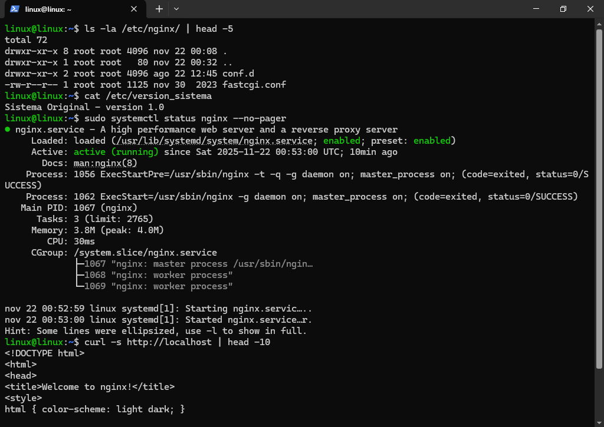
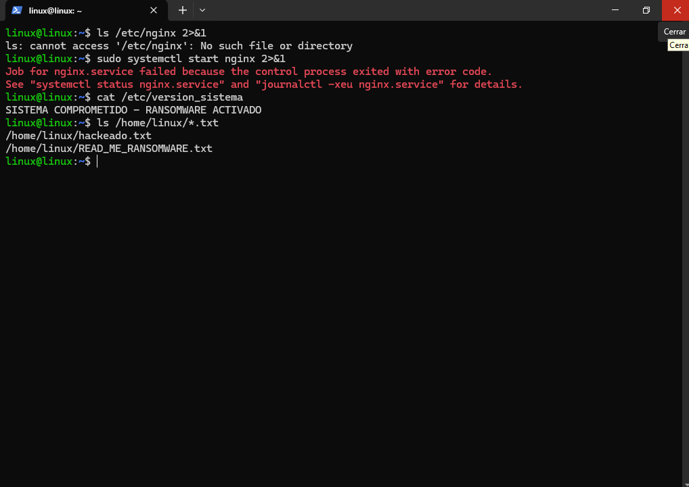
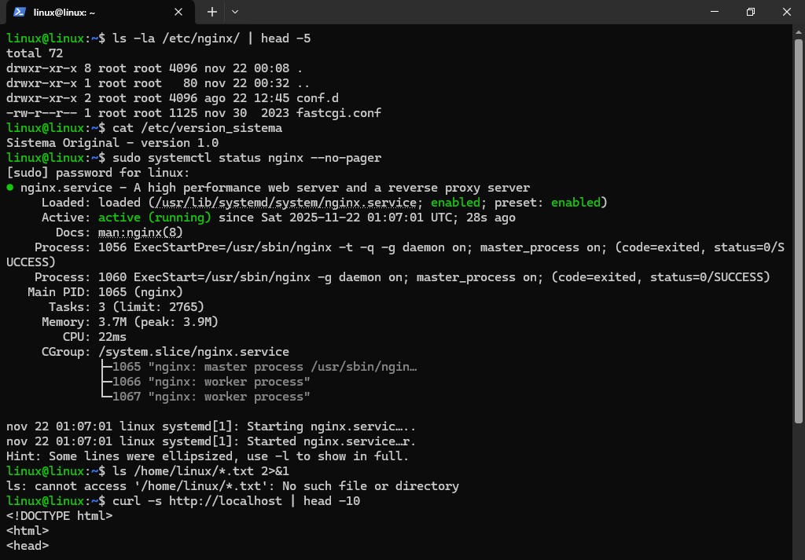

# 🛡️ Bastión Inmutable - Linux Immutable Root Configuration


## 📖 Descripción

Implementación de un sistema Linux con **Root Filesystem de solo lectura** usando **OverlayFS** para mitigación de intrusiones y prevención de **configuration drift**. Ideal para servidores bastión, kioskos, y entornos de alta seguridad.

## 🎯 Características Principales

- ✅ **Inmutabilidad del sistema** - Cambios temporales se pierden al reiniciar
- ✅ **Protección contra intrusiones** - Recuperación automática post-ataque
- ✅ **Mantenimiento controlado** - Cambios permanentes solo mediante `overlayroot-chroot`
- ✅ **Zero-touch restoration** - Restauración automática sin intervención

## 🏗️ Arquitectura del Sistema

```ascii
[ ESCRITURA (RAM/tmpfs) ]  ← Cambios temporales ⚡
           |
[ SISTEMA (OverlayFS) ]    ← Vista del usuario 👁️
           |
[ LECTURA (Disco Duro) ]   ← Sistema base inmutable 💾

🚀 Instalación y Configuración
Prerrequisitos
Ubuntu Server 20.04/22.04
Acceso sudo/root

Configuración Inmutable
# 1. Instalar overlayroot
sudo apt install overlayroot -y

# 2. Configurar inmutabilidad
echo 'overlayroot="tmpfs"' | sudo tee /etc/overlayroot.conf

# 3. Reiniciar sistema
sudo reboot

Verificación
# Verificar modo overlay activo
sudo mount | grep overlay

# Salida esperada:
# overlayroot on / type overlay (rw,relatime,lowerdir=/media/root-ro,...)

 Demostración de Inmutabilidad
🔴 Estado Comprometido (Pre-Reinicio)
# Simulación de ataque
sudo rm -rf /etc/nginx
touch /home/usuario/hackeado.txt
echo "SISTEMA COMPROMETIDO" | sudo tee /etc/version_sistema

# Verificar daños
ls /etc/nginx                    # No existe
sudo systemctl start nginx       # Fallo

🟢 Estado Restaurado (Post-Reinicio)
# Verificar recuperación automática
ls /etc/nginx/                   # Restaurado
sudo systemctl status nginx      # Activo
ls /home/usuario/hackeado.txt    # Eliminado

🛠️ Mantenimiento y Actualizaciones
# Acceder al sistema base
sudo overlayroot-chroot

# Realizar cambios persistentes
echo "Versión 1.1 - Actualizado" > /etc/version_sistema
apt update && apt upgrade -y

# Salir y reiniciar
exit
sudo reboot

📊 Casos de Uso

🛡️ Servidor Bastión
1.Protección contra modificaciones no autorizadas
2.Recuperación automática post-intrusión

🏢 Entornos Educativos/Laboratorios
1.Restauración a estado conocido
2.Prevención de modificaciones accidentales

🖥️ Kioskos/Estaciones Públicas
1.Resistente a modificaciones de usuarios
2.Mantenimiento simplificado

🧪 Pruebas Realizadas
Prueba	Resultado
Eliminación de /etc/nginx	      ✅ Restaurado
Creación archivos temporales	  ✅ Eliminados
Modificación configuración	    ✅ Revertida
Cambios con overlayroot-chroot	✅ Persistentes

 Contribuciones
Contribuciones son bienvenidas! Por favor:
1.Fork el proyecto
2.Crea una rama para tu feature
3.Commit tus cambios
4.Push a la rama
5.Abre un Pull Request

## 🧪 Pruebas Realizadas

## 🎥 Evidencia Visual

### Estado Inicial del Sistema


### Sistema Comprometido (Pre-Reinicio)


### Sistema Restaurado (Post-Reinicio)


📄 Licencia
Este proyecto está bajo la Licencia MIT - ver el archivo LICENSE para detalles.
¿Te sirvió este proyecto? ¡Dale una ⭐ al repositorio!
